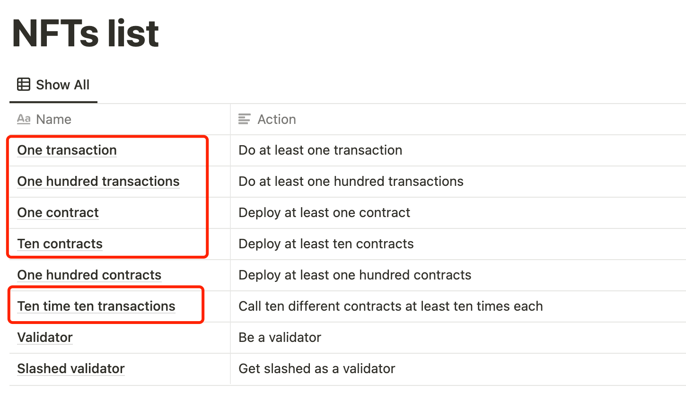

# kiln_testnet
deploy and interact with your own contracts

测试网gas price一度达到200gwei，导致网络很卡以及单次交互的成本很高，参考[测试网允许调用的api](https://rpc.kiln.themerge.dev/)，合约部署以及调用都用raw data的方式


## 1.获取测试币
前往 http://kiln-faucet.pk-net.net/ 进行Pow领测试币

## 2.下载及配置
* ###  克隆项目
```
git clone https://github.com/cloudcaution/kiln_testnet.git
```
* ### 安装python3依赖包
```
cd kiln_testnet
pip3 install -r requirements.txt
```
* ### 配置私钥
```

.env.example文件中的 PRIVATE_KEY=xxxx 将xxxx替换为自己的测试钱包私钥 此私钥地址需有足够的ETH用来转账给创建的ETH 地址
                     
                     ADDRESS=0xxxxx 将0xxxx替换为自己的测试钱包地址  
```

## 3.运行
```
python3 deploy.py
```
会分别提示你需要部署的合约数量和单个合约交互的次数，建议两次都输入11，保险起见大部分任务都能达成



尊重原作者 ZEF ZHOU 感谢他的前期工作， 我在他的基础之上加了一些东西，可以更好的白piao空投，

## 更新内容：
增加 ETH 地址创建 以及给每个地址灌水，
增加回收水功能， 由于当前gas 费过高， 设定 每个地址留0.1ETH以防归集错误。

## 使用说明
当运行deploy.py后，会需要用户打入相应的值来告诉脚本怎么做相应动作，
总共按顺序需要输入5个值 分别为：

### how many contracts do you want to deploy:  
（请输入需要创建多少个合约，原作者建议11个，则输入11 然后回车 输入0则跳过创建

### how many interactions do you want to do for each contract you deployed:    
（请输入每个合约交互多少次，原作者建议11次，则输入11 然后回车 输入0则跳过创建

### how many ETH address you want to create:                                   
（输入需要创建多少个ETH地址，按需填入数字， 然后回车 输入0则跳过

### How many ETH you want to send out to child address:                        
（输入往每个创建好的ETH地址打多少个ETH， 按需输入数字，然后回车， 输入0则跳过

### are you willing to send back your ETH from child address to your main address? please type in y/n: 
（输入y或者n来确认是否回收打入每个ETH地址的ETH， 然后回车， 输入n跳过


### 注意：
生成的ETH地址 存放在同目录的address.txt


